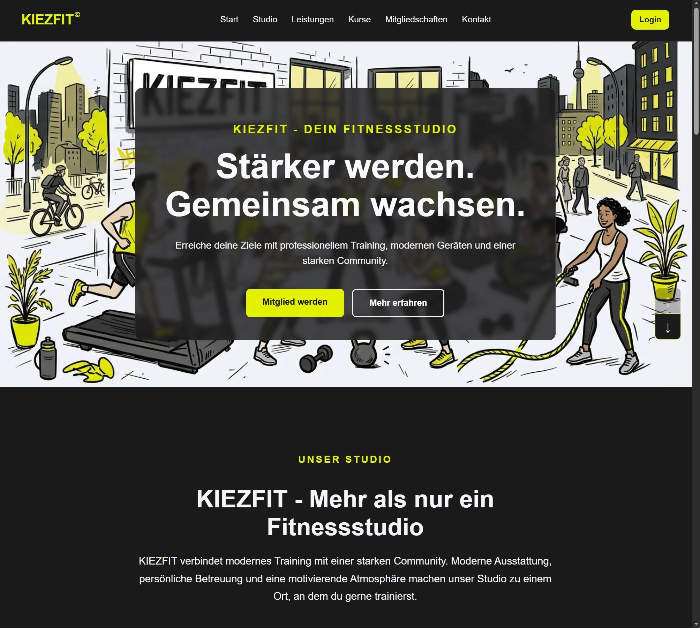

**KIEZFIT** - Responsive Fitnessstudio-Webprojekt entwickelt mit HTML, CSS und JavaScript.

**KIEZFIT** ist ein praxisorientiertes Webentwicklungsprojekt zur Konzeption
und Umsetzung einer modernen Fitnessstudio-Website.

Im Mittelpunkt stehen eine klare Benutzerführung, responsives Webdesign,
eine strukturierte HTML-/CSS-/JavaScript-Architektur sowie die
schrittweise Entwicklung interaktiver Funktionen.

<u>**Projekt:**</u> 
Die Website stellt ein fiktives Fitnessstudio digital vor und **umfasst** unter anderem:
* Studio
* Leistungen
* Kurse
* Mitgliedschaften
* Kontakt
* Login-Bereich

Das Projekt wurde von Grund auf entwickelt und im Verlauf kontinuierlich **optimiert**: 

* Struktur
* Responsivität
* Benutzerführung und
* Interaktion.

<u>**Features:**</u> 
* Responsive Layout für Desktop, Tablet und Mobile
* Responsive Navigation
* Mobile Hamburger-Navigation
* Smooth-Scroll-Funktion
* Interaktiver Scroll-Button
* Strukturierte Leistungs- und Informationsbereiche
* Responsive Kartenlayouts
* Separierte HTML-, CSS- und JavaScript-Dateien
* Organisierte Asset- und Seitenstruktur

<u>**Technologien:**</u> 
* HTML5
* CSS3
* JavaScript
* Git
* GitHub

<u>**Projektstruktur**</u> 
* KIEZFIT/
* ├── assets/
* │   └── images/
* ├── css/
* ├── doku/
* ├── js/
* ├── pages/
* ├── index.html
* ├── login.html
* └── README.md

<u>**Struktur:**</u> 
* assets/ = Enthält verwendete Medien und Bilddateien.

* css/ = Enthält die Stylesheets und das responsive Design.

* js/ = Enthält die ausgelagerte JavaScript-Logik und Interaktionen.

* pages/ = Enthält weitere HTML-Seiten des Projekts.

* doku/ = Enthält die Projektdokumentation und Informationen zum Entwicklungsprozess.

<u>**Entwicklungsprozess:**</u> 
KIEZFIT wird schrittweise entwickelt und über GitHub dokumentiert.

Der Entwicklungsprozess <u>**umfasst**</u> unter anderem: 
1. Planung und grundlegende Seitenstruktur
2. Aufbau des HTML-Grundgerüsts
3. Entwicklung des visuellen Designs
4. Aufbau der einzelnen Websitebereiche
5. Responsive Umsetzung
6. Auslagerung und Strukturierung des JavaScript-Codes
7. Entwicklung der Navigation und Interaktionen
8. Optimierung für unterschiedliche Bildschirmgrößen
9. Dokumentation und kontinuierliche Überarbeitung

<u>**Projektstatus:**</u> 
* Das Projekt befindet sich in aktiver Entwicklung.

* Neue Funktionen, Optimierungen und strukturelle Verbesserungen werden
schrittweise umgesetzt und dokumentiert.

<u>**Dokumentation:**</u> 
Eine ausführlichere Dokumentation des Entwicklungsprozesses befindet
sich im Verzeichnis doku/.

<u>**Ziel des Projekts**</u> 
KIEZFIT dient als praxisorientiertes Entwicklungsprojekt, um Kenntnisse in
der Frontend-Entwicklung zu vertiefen und den strukturierten
Entwicklungsprozess eines Webprojekts nachvollziehbar zu dokumentieren.
