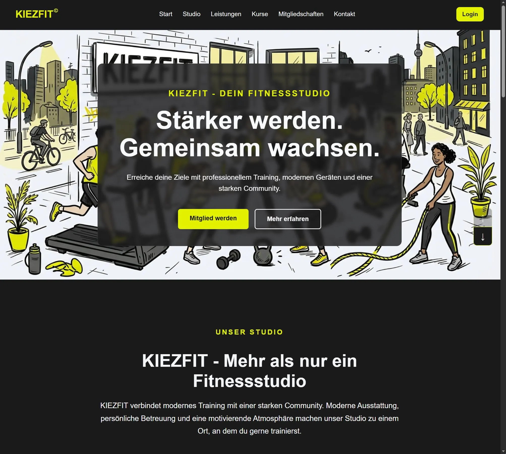

# KIEZFIT



**Responsive Fitnessstudio-Webprojekt mit HTML, CSS und JavaScript.**

[🌐 Live Demo](https://pxr-dev.github.io/KIEZFIT/)

## Projektbeschreibung

KIEZFIT ist ein praxisorientiertes Webentwicklungsprojekt zur Konzeption und Umsetzung einer modernen Fitnessstudio-Website.

Im Mittelpunkt stehen eine klare Benutzerführung, responsives Webdesign, eine strukturierte HTML-/CSS-/JavaScript-Architektur sowie die schrittweise Entwicklung und Optimierung interaktiver Funktionen.

Die Website stellt ein fiktives Fitnessstudio digital vor und umfasst unter anderem:

* Studio
* Leistungen
* Kurse
* Mitgliedschaften
* Kontakt
* vorbereiteten Login-Bereich

Das Projekt wurde von Grund auf entwickelt und im Verlauf kontinuierlich hinsichtlich Struktur, Responsivität, Benutzerführung und Interaktion optimiert.

## Features

* Responsive Layout für Desktop, Tablet und Mobile
* Responsive Navigation
* Mobile Hamburger-Navigation
* Smooth Scrolling
* Interaktive Scroll-Navigation
* Strukturierte Leistungs- und Informationsbereiche
* Responsive Kartenlayouts
* Accessibility-Grundlagen, unter anderem ARIA-Attribute
* Separierte HTML-, CSS- und JavaScript-Dateien
* Modulare CSS-Struktur
* Organisierte Asset- und Seitenstruktur
* Optimierte WebP-Bilddateien

## Technologien

* **HTML5** – semantische Seitenstruktur
* **CSS3** – Layout, Design und Responsive Design
* **JavaScript** – Navigation und Interaktionen
* **Git** – Versionsverwaltung
* **GitHub** – Repository, Versionshistorie und Projektverwaltung
* **GitHub Pages** – Deployment der Live-Demo

## Projektstruktur

```text
KIEZFIT/
├── assets/
│   ├── icons/
│   └── images/
│       ├── hero.webp
│       ├── kiezfit-preview.webp
│       └── studio.webp
├── css/
│   ├── base.css
│   ├── components.css
│   ├── layout.css
│   ├── responsive.css
│   └── sections.css
├── doku/
│   ├── decisions.html
│   ├── design.html
│   ├── issues.html
│   ├── milestones.html
│   ├── progress.html
│   ├── roadmap.html
│   └── technical.html
├── js/
│   └── script.js
├── pages/
│   ├── challenges.html
│   ├── dashboard.html
│   ├── ernaehrung.html
│   ├── fortschritt.html
│   ├── kurse.html
│   ├── mitgliedschaft.html
│   ├── nachrichten.html
│   ├── profil.html
│   ├── register.html
│   ├── studio.html
│   ├── training.html
│   └── trainingsplaene.html
├── .gitignore
├── CHANGELOG.md
├── index.html
├── login.html
└── README.md
```

### Struktur

* `assets/` – verwendete Medien und Bilddateien
* `css/` – modular aufgebaute Stylesheets für Basis, Layout, Komponenten, Bereiche und Responsive Design
* `js/` – ausgelagerte JavaScript-Logik und Interaktionen
* `pages/` – vorbereitete weitere Seiten des Projekts
* `doku/` – Projektdokumentation, technische Entscheidungen, Fortschritt und Entwicklungsplanung
* `CHANGELOG.md` – versionsbezogene Änderungen und Releases
* `index.html` – zentrale Landingpage
* `login.html` – vorbereiteter Login-Bereich
* `README.md` – Projektübersicht

## Entwicklungsprozess

KIEZFIT wird schrittweise entwickelt und über GitHub versioniert und dokumentiert.

Der Entwicklungsprozess umfasst unter anderem:

1. Planung und grundlegende Projektstruktur
2. Aufbau des HTML-Grundgerüsts
3. Entwicklung des visuellen Designs
4. Aufbau der einzelnen Websitebereiche
5. Umsetzung des Responsive Designs
6. Strukturierung und Auslagerung des JavaScript-Codes
7. Entwicklung der Navigation und Interaktionen
8. Optimierung für unterschiedliche Bildschirmgrößen
9. Browser- und Funktionstests
10. Überarbeitung der Projektstruktur und Dokumentation
11. Vorbereitung des ersten stabilen Releases

Die Entwicklung erfolgt iterativ. Funktionen, Strukturen und Dokumentation werden überprüft und bei Bedarf schrittweise verbessert.

## Dokumentation

Die ausführliche Projektdokumentation befindet sich im Verzeichnis [`doku/`](doku/).

Dort werden unter anderem folgende Bereiche dokumentiert:

* [Roadmap](doku/roadmap.html)
* [Projektfortschritt](doku/progress.html)
* [Design](doku/design.html)
* [Technische Struktur](doku/technical.html)
* [Technische Entscheidungen](doku/decisions.html)
* [Issues](doku/issues.html)
* [Milestones](doku/milestones.html)

Zusätzlich dokumentiert [`CHANGELOG.md`](CHANGELOG.md) die wichtigsten Änderungen auf Versionsebene.

Die vollständige technische Historie des Projekts ist über das GitHub-Repository nachvollziehbar.

## Projektstatus

**Version 0.1.0 – Erste stabile Projektgrundlage**

Die grundlegende Landingpage, das Responsive Design, die Navigation, JavaScript-Interaktionen, Accessibility-Grundlagen, Asset-Optimierung und die Projektdokumentation sind umgesetzt.

Weitere Funktionen und strukturelle Erweiterungen sind für zukünftige Versionen vorgesehen.

## Live Demo

Die aktuelle Version des Projekts ist online verfügbar:

[🌐 KIEZFIT Live Demo](https://pxr-dev.github.io/KIEZFIT/)

## Ziel des Projekts

KIEZFIT dient als praxisorientiertes Entwicklungsprojekt, um Kenntnisse in der Frontend-Entwicklung zu vertiefen und einen strukturierten Entwicklungsprozess nachvollziehbar zu dokumentieren.

Neben der technischen Umsetzung steht dabei auch die kontinuierliche Verbesserung von Code-Struktur, Responsive Design, Benutzerführung, Accessibility, Performance und Projektdokumentation im Mittelpunkt.
